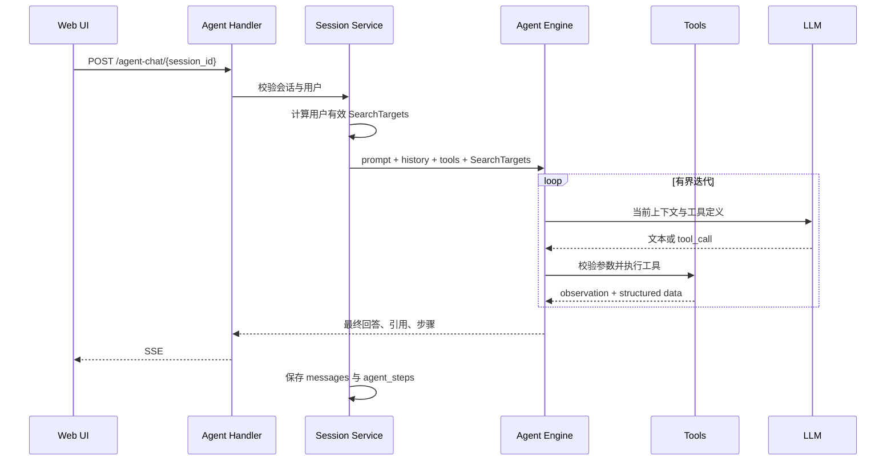

# 智能体运行时与内置工具

## 1. 入口与代码

- Agent HTTP：`POST /api/v1/agent-chat/{session_id}`
- 会话服务：`internal/application/service/session_agent_qa.go`
- Agent Service：`internal/application/service/agent_service.go`
- 循环引擎：`internal/agent/engine`
- 工具注册：`internal/agent/tools/registry.go`
- 工具实现：`internal/agent/tools`
- 事件模型：`internal/agent/event.go`

`event.go` 定义 Agent Loop 对外发送的事件，例如思考、工具调用、工具结果、正文
Token、引用、完成和错误。Handler 将事件转换为 SSE 发给前端。

## 2. 一轮 Agent QA



智能体配置保存模型、系统提示词、允许工具和搜索质量参数，不保存知识库授权。
每轮都以当前用户身份计算全部有效知识范围，撤销授权后下一轮立即失效。智能体
历史配置中的知识库选择和本轮 `@知识库` 不参与初始授权范围；工具参数仍可在用户
范围内继续缩小查询。

## 3. 知识工具

### `knowledge_search`

输入：

```json
{
  "queries": ["境外差旅审批流程是什么"],
  "knowledge_base_ids": ["可选，最多 10 个"]
}
```

`queries` 必须 1 到 5 个。可选知识库只能从预计算 `SearchTargets` 中继续过滤。
目录 allow/deny 已在预计算阶段展开为可读 `knowledge_ids`，工具不会把目录规则
交给 Milvus 现场判断。
工具并发执行语义/关键词检索、RRF、去重、可选 Rerank 和 MMR，返回 XML 观察结果
及结构化 Chunk 数据。

### `grep_chunks`

对 PostgreSQL `chunks.content` 和 `knowledges.title` 执行正则搜索。输入支持一个
或多个 pattern、结果模式和数量限制；后端会编译正则、限制范围、最多拉取有限
候选，然后计算命中次数、片段和去重结果。

它适合错误码、合同编号、人名和固定短语，不适合语义相近但字面不同的问题。
PostgreSQL 不会在对象存储文件内部直接 grep；搜索对象是已经解析落库的 Chunk。

### `list_knowledge_chunks`

三种精确目标只能选一种：

```json
{"knowledge_id":"doc-id","limit":20,"offset":0}
{"chunk_id":"chunk-id"}
{"faq_id":"faq-chunk-id"}
```

按文档分页时最多 100 条/页；返回 Chunk 正文、类型、位置、父块和图片信息。调用
前先验证该文档是否在当前用户授权范围。

### `get_document_info`

输入：

```json
{
  "knowledge_ids": ["doc-id-1", "doc-id-2"],
  "faq_ids": ["faq-chunk-id"]
}
```

返回标题、描述、来源、文件名/类型/大小、解析状态、Chunk 数和 metadata。
`description` 来自 `knowledges.description`；`metadata` 来自上传、解析器、数据源
或手工内容创建阶段写入的 `knowledges.metadata`。

### `query_knowledge_graph`

输入 `knowledge_base_ids[1..10]` 和 `query`。工具只允许查询已授权的知识库/文档
namespace，返回实体、关系、属性和来源 Chunk ID。

### `database_query`

输入：

```json
{"sql":"SELECT title, parse_status FROM knowledges ORDER BY updated_at DESC LIMIT 10"}
```

只允许单条只读 SELECT，且只允许 `knowledge_bases`、`knowledges`、`chunks`。
SQL 校验器自动加入软删除和用户授权范围，禁止 CTE、子查询、系统列、危险函数和
跨 schema 访问。这是查询知识元数据，不是访问任意业务数据库。

## 4. 表格工具

### `data_schema`

输入：

```json
{"knowledge_id":"excel-document-id"}
```

读取 PostgreSQL 中该文档的 `table_summary` 与 `table_column` Chunk，快速告诉模型
表名、字段含义和行数。它不在调用时重新扫描 Excel。

### `data_analysis`

输入：

```json
{
  "knowledge_id": "excel-document-id",
  "sql": "SELECT region, SUM(amount) FROM excel-document-id GROUP BY region"
}
```

工具先从对象存储读取授权范围内的 Excel/CSV，加载到会话级 DuckDB 表
`k_<knowledge_uuid>`，把 SQL 中知识 ID 替换为实际表名，再执行只读查询。支持
`SELECT`、`SHOW`、`DESCRIBE`、`EXPLAIN`、`PRAGMA`；禁止修改语句和危险函数。
多 Sheet Excel 合并后增加 `__sheet_name` 列。会话结束时清理临时表。

## 5. 其他工具

- `thinking`：内部思考/反思步骤。
- `todo_write`：复杂任务计划。
- `text_counter`：字符、非空白字符、单词和行数统计。
- `web_search` / `web_fetch`：启用网络搜索时使用。
- `read_skill`：仅在 Skill 功能开启时注册。
- MCP 工具：仅在 MCP 功能开启且服务配置有效时动态注册。

## 6. 安全边界

1. 工具列表由服务端配置生成，模型不能发明一个未注册工具。
2. 参数必须通过 JSON Schema 和工具内部校验。
3. 所有知识工具共享同一 `SearchTargets`。
4. 数据分析和数据库查询只读且受允许表/文件限制。
5. 工具调用、结果摘要和耗时写入 `messages.agent_steps`，Langfuse 可记录 Trace。
6. 最终引用必须回到真实 `chunk_id`；模型输出不是授权依据。
