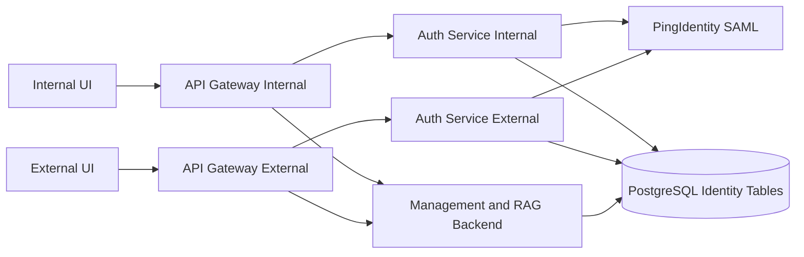
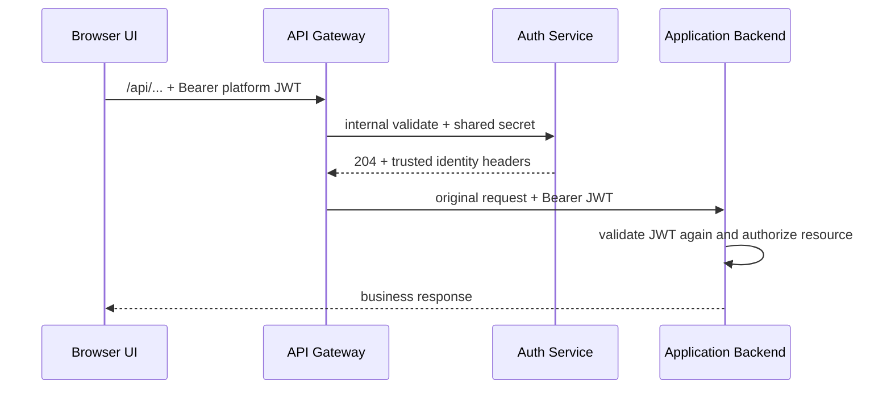

# Auth Service and API Gateway Architecture

## 1. Decision

Login is a separately deployed platform capability. It is not part of the management backend and is not owned by the RAG/agent runtime.

Two image types are built:

1. `knowledge-agent-platform-auth-service`
2. `knowledge-agent-platform-api-gateway`

Production deploys each image twice, once per trust zone. This produces two image types and four running instances, not four separately maintained codebases.

## 2. Logical topology

## 3. Component ownership

| Component | Owns | Must not own |
|---|---|---|
| Gateway | public route boundary, token pre-validation, trusted header overwrite, request forwarding | user persistence, SAML assertion parsing, business authorization |
| Auth Service | password dev login, SAML/OIDC protocol, platform JWT/refresh lifecycle, external identity mapping | knowledge ingestion, RAG, agent execution |
| Application Backend | business APIs, knowledge authorization, RAG and agents, second JWT validation | login redirects, IdP metadata, SAML ACS |
| PingIdentity | employee authentication and signed SAML assertions | platform roles and knowledge permissions |
| Workday adapter | organization/worker projection | authentication and implicit knowledge grants |

## 4. Zone isolation

Internal and external deployments share source and image versions but use different runtime configuration:

| Setting | Internal | External |
|---|---|---|
| Gateway DNS/Ingress | internal-only | approved external entry |
| SAML SP entity ID | unique internal ID | unique external ID |
| ACS URL | internal HTTPS URL | external HTTPS URL |
| SP certificate/key | internal pair | external pair |
| Redirect allowlist | internal UI origins | external UI origins |

The platform JWT signing policy and user database are shared so a token has the same semantics across business services. Network policies must prevent public access to Auth Service internal endpoints and backend service ports.

## 5. Protected request flow

Invalid or expired tokens stop at Gateway. A valid identity can still receive `403` from the Application Backend when knowledge or administration authorization fails.

## 6. Source map

| Area | Path |
|---|---|
| Auth Service executable | `cmd/auth-service/main.go` |
| Auth-only router and internal validator | `internal/authserver/` |
| SAML/OIDC handlers | `internal/handler/auth.go` |
| SAML service implementation | `internal/application/service/saml.go` |
| Signed state and redirect validation | `internal/utils/sso_state.go`, `internal/utils/redirect_uri.go` |
| Gateway Nginx policy | `docker/gateway/` |
| Auth/Gateway images | `docker/Dockerfile.auth-service`, `docker/Dockerfile.gateway` |
| Deployment instances | `docker-compose.server-dev.yml`, `docker-compose.production.yml` |

## 7. Frontend contract

Frontend code uses same-origin `/api/v1/auth/*` paths and never calls Auth Service or the Application Backend service port directly. It discovers available login modes from config endpoints, initiates SAML/OIDC through Gateway, consumes the callback fragment, and sends the platform access token as a Bearer token.

The frontend must not trust or generate `X-Authenticated-*` headers. Gateway removes client values and writes only Auth Service-validated values.

Refresh Tokens are browser-managed credentials. Auth Service writes an
`HttpOnly; SameSite=Lax` cookie scoped to `/api/v1/auth`; production enforces
`Secure`. Callback fragments and JSON responses contain only the Access Token.
The two trust zones use different Gateway-to-Auth shared secrets, and dedicated
Docker networks ensure each Gateway can reach only its matching Auth Service.
