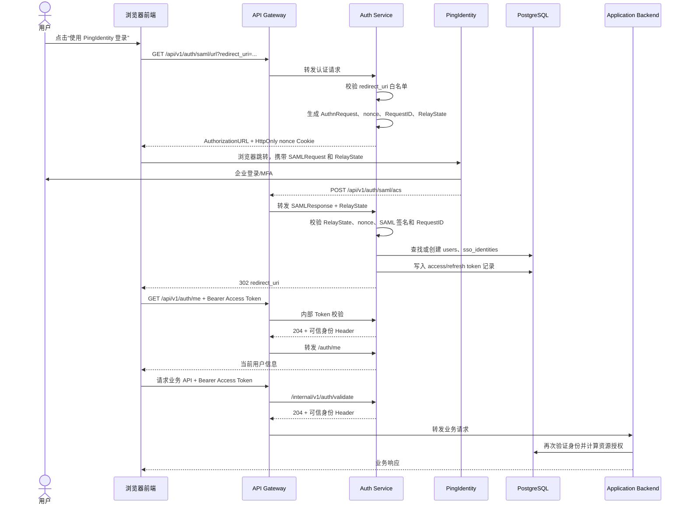

# PingIdentity SAML 登录完整链路

本文基于当前源码说明用户从前端点击“使用 PingIdentity 登录”，到取得平台 Token、进入系统并访问业务 API 的完整链路。

> 文档状态：2026-08-09。本文同时区分“目标端到端链路”和“当前已经落地的代码”。
> 独立 Auth Service、内外网 API Gateway、后端 SAML SP、平台 Token 生命周期、四套前端 SAML 接线和生产安全控制已经实现。
> 本地与服务器开发使用 Mock SAML IdP 完成端到端验证；正式环境替换为 PingIdentity metadata、SP 身份和证书后进行企业联调验收。

## 1. 参与组件

| 组件 | 职责 |
|---|---|
| 浏览器前端 | 发现 SAML 能力、跳转 IdP、消费回调结果、保存 Access Token，并使用 HttpOnly Refresh Cookie |
| API Gateway | 统一入口、转发认证请求、预校验业务请求中的 Access Token |
| Auth Service | SAML SP、用户映射、平台 JWT 与 Refresh Token 生命周期 |
| PingIdentity | SAML IdP、企业账号认证、MFA、签发 SAML Assertion |
| PostgreSQL | 保存 `users`、`sso_identities`、`auth_tokens` 等身份数据 |
| Application Backend | 业务接口、知识库授权、RAG 和 Agent；不负责 SAML 登录协议 |

平台在 SAML 协议中扮演 Service Provider（SP），PingIdentity 扮演 Identity Provider（IdP）。

## 2. 登录前信任配置

用户登录之前，需要先在平台和 PingIdentity 之间建立 SAML 信任。

平台提供 SP Metadata：

```http
GET /api/v1/auth/saml/metadata
```

Metadata 包含：

- SP Entity ID
- ACS 回调地址
- SP 公钥证书
- 支持的 SAML Binding

PingIdentity 向平台提供：

- IdP Entity ID
- SSO 地址
- IdP 签名证书
- IdP Metadata XML
- SAML Assertion 中的 `subject`、`email`、`username` 等属性名称

内网和外网部署使用不同的 SP Entity ID、ACS URL、SP 证书、Auth Service 和 API Gateway 实例，但共享用户数据库和平台 JWT 签名策略。

## 3. 目标端到端时序

下面时序是当前前后端共同实现的接口契约和完整运行链路。



## 4. 前端发现 SAML 登录能力

登录页应先调用：

```http
GET /api/v1/auth/saml/config
```

返回示例：

```json
{
  "success": true,
  "data": {
    "enabled": true,
    "provider_display_name": "PingIdentity"
  }
}
```

前端根据 `enabled` 决定是否显示企业 SSO 登录按钮。

## 5. 用户发起 SAML 登录

用户点击按钮后，前端请求：

```http
GET /api/v1/auth/saml/url?redirect_uri=https://kap.roche.com/
```

请求通过对应网络区域的 Gateway：

```text
内网用户 -> api-gateway-internal -> auth-service-internal
外网用户 -> api-gateway-external -> auth-service-external
```

Gateway 对 `/api/v1/auth/*` 直接转发给 Auth Service，因为用户此时还没有平台 Token。

Auth Service 会对 `redirect_uri` 做精确白名单检查。白名单来自：

```env
AUTH_ALLOWED_REDIRECT_URIS=https://kap.roche.com/,https://kap.roche.com/login
```

不在白名单中的地址会被拒绝，避免登录结果被重定向到恶意站点。

## 6. 创建 AuthnRequest 和 RelayState

Auth Service 第一次使用 SAML 时会初始化并缓存 SAML SP：

1. 从 URL、本地文件或配置文本读取 PingIdentity IdP Metadata。
2. 解析 IdP Entity ID、SSO 地址和签名证书。
3. 读取 SP 证书和私钥。
4. 校验 SP Entity ID 和绝对 ACS URL。
5. 根据 `SAML_AUTH_SIGN_REQUEST` 决定是否对 AuthnRequest 签名。

随后生成：

- 随机 `nonce`
- SAML `RequestID`
- SAML `AuthnRequest`
- HMAC-SHA256 签名的 `RelayState`

RelayState 中保存：

```json
{
  "nonce": "browser-random-value",
  "redirect_uri": "https://kap.roche.com/",
  "request_id": "_saml-request-id",
  "iat": 1786240000
}
```

RelayState 有效期为 10 分钟。Auth Service 同时设置一次性浏览器 Cookie：

```text
roche_kap_saml_nonce
HttpOnly
SameSite=Lax
Max-Age=600
```

响应中包含 PingIdentity 登录地址：

```json
{
  "success": true,
  "authorization_url": "https://ping.roche.com/idp/SSO.saml2?SAMLRequest=...&RelayState=...",
  "relay_state": "...",
  "provider_display_name": "PingIdentity"
}
```

前端通过 `window.location.href = authorization_url` 将浏览器跳转到 PingIdentity。

## 7. PingIdentity 企业认证

PingIdentity 接收 `SAMLRequest`、`RelayState`，以及启用请求签名时的 `SigAlg` 和 `Signature`。

PingIdentity 负责：

- 检查是否已有企业登录会话
- 企业用户名密码认证
- MFA
- 企业账号状态检查
- 生成并签名 SAML Assertion

平台不会接触用户的企业密码。

登录成功后，PingIdentity 通常通过浏览器表单 POST 到 ACS：

```http
POST /api/v1/auth/saml/acs
Content-Type: application/x-www-form-urlencoded

SAMLResponse=<Base64 SAML Response>
RelayState=<原样返回的 RelayState>
```

## 8. ACS 校验

ACS 请求经 Gateway 转发给 Auth Service。Auth Service 先校验 RelayState：

1. 验证 HMAC 签名。
2. 验证签发时间不超过 10 分钟。
3. 读取 `redirect_uri` 和 `request_id`。
4. 读取 `roche_kap_saml_nonce` Cookie。
5. 比较 Cookie nonce 与 RelayState nonce。
6. 校验成功后删除一次性 Cookie。

随后使用 IdP Metadata 中的证书解析和校验 SAMLResponse，包括：

- XML 签名
- 证书信任
- Assertion 有效时间
- Audience
- ACS Destination 和 Recipient
- `InResponseTo` 是否对应本次 AuthnRequest 的 RequestID

如果失败，Auth Service 重定向前端：

```text
https://kap.roche.com/#saml_error=login_failed
```

## 9. 身份属性映射

校验通过后，Auth Service 从 Assertion 中提取：

```text
subject
email
username
```

映射配置示例：

```env
SAML_USER_INFO_MAPPING_SUBJECT=subject
SAML_USER_INFO_MAPPING_EMAIL=email
SAML_USER_INFO_MAPPING_USER_NAME=username
```

代码也支持 `mail`、`uid`、`displayName` 和常见 OID 属性名称作为回退。

这里建立的是用户身份，不会在登录阶段计算知识库、目录或文档权限。

## 10. 本地用户映射和自动开通

Auth Service 首先查询 `sso_identities`：

```text
provider = saml
issuer   = PingIdentity Entity ID
subject  = PingIdentity 中稳定的用户标识
```

示例：

```text
provider = saml
issuer   = https://ping.roche.com
subject  = 00u8abc123
```

处理顺序：

1. 找到 `sso_identities`：通过 `user_id` 查询 `users`。
2. 没有 SSO 映射：尝试通过企业邮箱查找现有 `users`。
3. 用户不存在且 `SAML_AUTH_AUTO_PROVISION=true`：创建用户和 SSO 映射。
4. 用户不存在且自动开通关闭：拒绝登录并提示联系管理员。

首次自动开通会在同一事务中写入：

```text
users
sso_identities
```

SSO 用户会获得随机生成的不可知密码及其哈希，用户不会获得该随机密码，不能依赖它进行邮箱密码登录。

随后检查用户账号状态。拉黑、离职或禁用用户不能继续登录。

## 11. 签发平台 Token

PingIdentity 的 SAML Assertion 不直接作为业务 API 凭证。Auth Service 签发平台自己的 Token。

### 11.1 Access Token

当前有效期为 24 小时：

```json
{
  "user_id": "U1001",
  "email": "zhangsan@roche.com",
  "is_system_admin": false,
  "role_knowledge_officer": 0,
  "iat": 1786240000,
  "exp": 1786326400,
  "type": "access"
}
```

知识库、目录和文档 ID 不写入 JWT，资源授权在业务请求时从 PostgreSQL 动态计算。

### 11.2 Refresh Token

当前有效期为 7 天：

```json
{
  "user_id": "U1001",
  "iat": 1786240000,
  "exp": 1786844800,
  "type": "refresh"
}
```

Access Token 和 Refresh Token 当前都写入 `auth_tokens`，用于撤销、刷新和退出登录。

## 12. 回跳前端

当前 Auth Service 通过 URL Fragment 返回登录结果：

```text
https://kap.roche.com/#saml_result=<Base64URL 编码 JSON>
```

解码后的数据示例：

```json
{
  "success": true,
  "user": {
    "id": "U1001",
    "email": "zhangsan@roche.com"
  },
  "token": "<Access Token>",
  "is_new_user": true
}
```

Refresh Token 不进入 URL。Auth Service 在回跳响应中写入作用域为
`/api/v1/auth` 的 `HttpOnly + SameSite=Lax` Cookie；生产环境强制附加
`Secure`。URL 中 `#` 后面的 Fragment 只包含前端需要读取的 Access Token
及非敏感登录结果。

前端应当：

1. 读取 `saml_result` 或 `saml_error`。
2. Base64URL 解码登录结果。
3. 保存 Access Token；Refresh Token Cookie 由浏览器自动管理，JavaScript 无法读取。
4. 使用 `history.replaceState` 清除 URL Fragment。
5. 请求 `/api/v1/auth/me` 获取当前用户。
6. 根据用户角色进入知识管理端或对话端。

## 13. 登录后的业务请求

前端请求业务接口：

```http
GET /api/v1/knowledge-bases
Authorization: Bearer <platform-access-token>
```

Gateway 在转发前发起内部验证子请求：

```http
GET /internal/v1/auth/validate
Authorization: Bearer <platform-access-token>
X-Auth-Service-Secret: <内部共享密钥>
```

Auth Service 检查：

- JWT 签名和有效期
- `type=access`
- `auth_tokens` 中存在且未撤销
- 用户账号状态正常

验证成功后返回：

```text
204 No Content
X-Authenticated-User-ID: U1001
X-Authenticated-Email: zhangsan@roche.com
X-Authenticated-System-Admin: false
X-Authenticated-Knowledge-Officer: 0
```

Gateway 会覆盖客户端提交的同名 Header，再把 Bearer Token 和可信身份 Header 转发到 Application Backend。

Application Backend 再次验证 JWT，然后查询 PostgreSQL 计算用户对知识库、目录和文档的实际权限。因此职责边界是：

```text
PingIdentity：证明用户是谁
Auth Service：映射用户并签发平台身份
API Gateway：阻止无效身份请求进入业务后端
Application Backend：判断用户能访问和管理哪些业务资源
```

## 14. Token 刷新与退出

Access Token 过期后，Gateway 返回 `401`。前端调用刷新接口，浏览器自动携带
HttpOnly Refresh Token Cookie：

```http
POST /api/v1/auth/refresh
Cookie: roche_kap_refresh_token=<旧 Refresh Token>
```

Auth Service：

1. 校验 Refresh Token 的签名、类型和有效期。
2. 查询 `auth_tokens`，确认未撤销。
3. 撤销旧 Refresh Token。
4. 生成新的 Access Token 和 Refresh Token。
5. 响应体只返回新的 Access Token，并通过 `Set-Cookie` 原子轮换 Refresh Token。

退出登录：

```http
POST /api/v1/auth/logout
Authorization: Bearer <Access Token>
```

当前实现会撤销该用户全部有效 Token。

## 15. 当前实现状态与完成边界

### 15.1 已完成的认证边界改造

以下能力已经完成代码实现和自动化验证：

- 登录能力已经从 Management/RAG Backend 中拆出，由独立 `auth-service` 可执行程序负责。
- API Gateway 与 Auth Service 分别构建为独立镜像。
- 内网和外网各部署一套 Gateway/Auth Service，共两种镜像、四个运行实例。
- Auth Service 已实现 SAML Metadata、登录地址生成、ACS、断言校验、用户映射和平台 Token 签发。
- Gateway 已实现业务 API 的 Token 预校验、可信身份 Header 覆盖和请求转发。
- Application Backend 只负责业务授权、知识库、RAG 和 Agent，不再拥有 SAML 协议端点。
- Refresh Token Cookie、区域隔离、独立 SP 配置、内部校验密钥和生产证书启动校验已经实现。
- `frontend`、`frontend-default`、`frontend-admin`、`frontend-app` 均已接入 SAML 能力发现、登录跳转和回调处理。
- 四套前端均通过 Gateway 访问认证接口，使用 Bearer Access Token 和 HttpOnly Refresh Cookie。
- 本地和服务器开发通过独立 Mock SAML IdP 验证同一套 SP-initiated 链路，不需要客户 PingIdentity 参数。

因此，除真实 PingIdentity 企业联调外，SSO 独立服务和前端接线已经完成。

### 15.2 已完成的前端 SAML 接线

四套前端统一处理：

```text
saml_result
saml_error
```

前端已实现：

- 调用 `/api/v1/auth/saml/config` 发现 SAML 能力。
- 根据 `provider_display_name` 显示企业 SAML 登录按钮。
- 调用 `/api/v1/auth/saml/url` 并跳转当前环境 IdP。
- 消费 `saml_result`、`saml_error` 回调结果。
- 保存 Access Token，随后调用 `/api/v1/auth/me` 恢复用户状态。
- 使用 Cookie 刷新 Token，不把 Refresh Token 暴露给 JavaScript。

当前状态是：

```text
后端 SAML 链路：已实现
前端 SAML 接线：已实现
Mock SAML 端到端登录：已实现
PingIdentity 企业联调：等待客户环境参数
```

### 15.3 四套前端的 Refresh Token 适配状态

| 前端源码 | 入口 | HttpOnly Refresh Cookie 适配 |
|---|---|---|
| `frontend` | `/`，本地端口 `5173` | 已完成；不再读取或保存 Refresh Token，并使用 `withCredentials` |
| `frontend-default` | 默认用户端构建 | 已完成；与根入口使用同一 Cookie 模式 |
| `frontend-admin` | 管理端构建 | 已完成；与根入口使用同一 Cookie 模式 |
| `frontend-app` | 会话端构建 | 已完成；与根入口使用同一 Cookie 模式 |

### 15.4 外部依赖联调

真实 PingIdentity 联调仍需要客户提供并确认：

- 内网和外网 SP Entity ID、ACS URL 注册结果。
- 两套 SP 证书及私钥的受控部署路径。
- IdP Metadata、签名证书和 SSO 地址。
- `subject`、`email`、`username` 的实际 Assertion 属性名称。
- 测试账号、MFA 策略、账号禁用和会话过期场景。

这些属于企业环境配置和验收，不阻塞后端源码编译与本地自动化测试，但缺少它们不能宣称真实 PingIdentity 已完成联调。

## 16. 安全加固状态

以下控制已经由代码和生产部署校验共同强制执行：

1. 后端仅通过 `HttpOnly + SameSite=Lax` Cookie 交付 Refresh Token，生产环境强制 `Secure`；Refresh Token 不再进入 URL Fragment 或响应 JSON，四套前端均不保存 Refresh Token。
2. 内外网 Auth Service 必须使用不同 SP Entity ID、ACS URL、证书和私钥。
3. `/internal/v1/auth/validate` 仅位于 Gateway 与对应 Auth Service 的区域专用网络中；Gateway 覆盖客户端伪造 Header，并使用区域独立、至少 48 字符的共享密钥。
4. 生产 Auth Service 禁止临时 SP 证书；缺少稳定证书、私钥或区域配置不匹配时直接拒绝启动。

按当前项目决策，`auth_tokens` 仍保存完整 Token 以支持现有撤销与轮换逻辑，本次改造不修改该表及其持久化方式。

## 17. 主要源码位置

| 功能 | 路径 |
|---|---|
| Auth Service 启动入口 | `cmd/auth-service/main.go` |
| Auth Service 路由 | `internal/authserver/router.go` |
| Gateway 内部 Token 校验 | `internal/authserver/internal_auth.go` |
| SAML HTTP Handler | `internal/handler/auth.go` |
| SAML SP、Assertion 校验和用户映射 | `internal/application/service/saml.go` |
| 开发 Mock SAML IdP | `cmd/mock-saml-idp/main.go` |
| 前端 SAML 回调解析 | `frontend*/src/utils/sso.ts` |
| 平台 JWT、刷新和登出 | `internal/application/service/user.go` |
| RelayState 签名与校验 | `internal/utils/sso_state.go` |
| Redirect URI 白名单校验 | `internal/utils/redirect_uri.go` |
| Gateway Nginx 配置 | `docker/gateway/default.conf.template` |
| 内外网部署实例 | `docker-compose.server-dev.yml`、`docker-compose.production.yml` |

## 18. 端到端验收条件

只有同时满足以下条件，才能把“PingIdentity SAML 登录”标记为完整完成：

1. `frontend` 及计划对外开放的其他前端入口完成 SAML 按钮和回调接线（代码已完成）。
2. 浏览器从对应区域 Gateway 发起登录，不直接访问 Auth Service 或 Application Backend 端口。
3. PingIdentity 成功校验各区域 SP Metadata、ACS URL 和请求签名。
4. 首次登录正确创建或绑定 `users`、`sso_identities`，并写入现有 `auth_tokens`。
5. Access Token 可通过 Gateway 访问业务 API，过期后可通过 HttpOnly Cookie 完成轮换。
6. 禁用用户、错误签名、错误 Audience、过期 Assertion、错误 RelayState 和错误内部共享密钥均被拒绝。
7. 内外网实例使用不同 SP 身份、证书和 Gateway 共享密钥，且无法跨区域直接调用内部校验端点。
