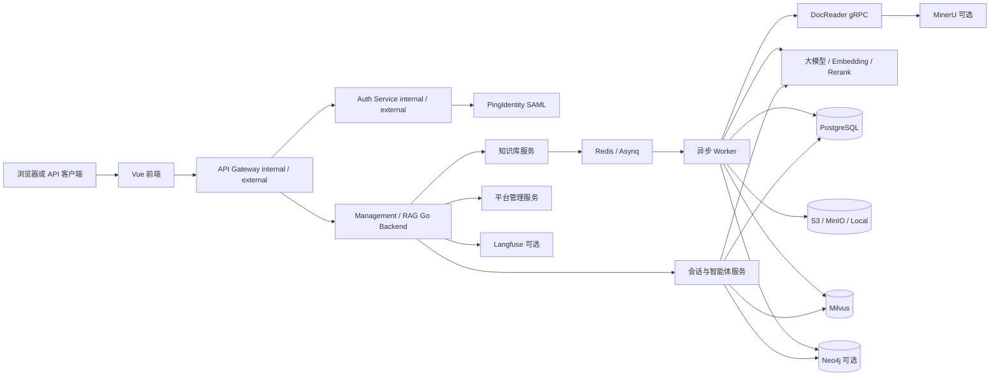
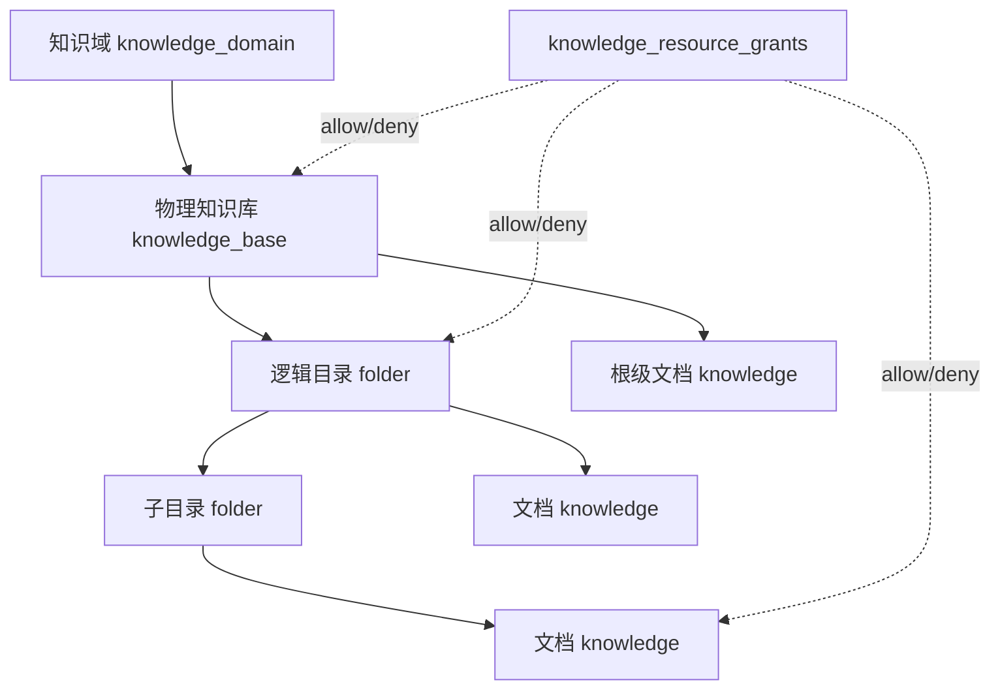

# 系统架构

## 1. 总体目标

系统面向企业内部知识管理和智能问答，提供四条主链路：

1. 身份认证与企业组织同步。
2. 文档接入、解析、切片和索引。
3. 用户授权范围内的 RAG 检索。
4. 基于工具调用的 ReAct 智能体问答。

## 2. 逻辑组件



### 2.1 业务资源层级

系统将物理知识库和逻辑资源树分开建模：



- 知识域是管理和配置边界，不是企业 HR 部门。
- 一个知识库共用解析、切片、向量存储和图谱配置。
- 目录和文档是知识库内可授权的逻辑资源，不会各自创建 Milvus Collection。
- 企业组织节点只是可批量授权的主体；仅属于组织不会自动获得知识权限。

## 3. 运行组件职责

| 组件 | 职责 | 不负责 |
|---|---|---|
| Vue 前端 | 登录、知识库管理、授权、对话、配置页面 | 权限最终裁决 |
| API Gateway | 区域入口、Token 预验证、路由和可信身份头覆盖 | SAML 解析、业务权限裁决 |
| Auth Service | SAML/OIDC、开发密码登录、平台 Token、外部身份映射 | 知识库、RAG 和 Agent 业务 |
| Go API | REST/SSE、业务编排、二次 JWT 校验、资源权限校验、任务投递 | 登录协议和大文件深度解析 |
| Worker | 文档解析、切片、Embedding、摘要、问题生成、图谱抽取 | 直接向用户提供页面 |
| DocReader | 将 PDF、DOCX、Excel 等转换为结构化解析结果 | 用户和知识权限 |
| MinerU | 高精度 PDF/Office 解析，可返回 Markdown 与图片 | 切片、授权、向量索引 |
| PostgreSQL | 用户、组织、统一资源 ACL、知识元数据、Chunk、会话、配置、审计 | 标准部署中的向量近邻搜索 |
| Milvus | Chunk 向量和可过滤字段，执行向量/混合检索 | 原文件和用户权限主数据 |
| Redis | Asynq 队列、任务状态、流式生成协调、缓存 | 长期业务事实 |
| 对象存储 | 原文件、解析图片、会话附件 | Chunk 和权限关系 |
| Neo4j | 实体、关系和 Chunk 来源映射 | 普通文本向量召回 |
| DuckDB | 临时加载 Excel/CSV 并执行分析 SQL | 常驻业务数据库 |
| Langfuse | LLM 调用、Agent span、Token 和时延追踪 | 平台登录与授权 |

## 4. 进程入口

| 入口 | 路径 | 说明 |
|---|---|---|
| 业务服务主程序 | `cmd/server/main.go` | 配置、容器、业务路由、Worker 同进程启动 |
| 认证服务主程序 | `cmd/auth-service/main.go` | Auth-only 路由和身份数据库连接 |
| Gateway 配置 | `docker/gateway/default.conf.template` | Auth/业务/静态前端路由边界 |
| 路由装配 | `internal/router/router.go` | `/api/v1` 的唯一权威路由清单 |
| 依赖容器 | `internal/container/container.go` | Repository、Service、Handler 和外部客户端装配 |
| 前端入口 | `frontend/src/main.ts` | Vue 应用启动 |
| DocReader 服务 | `docreader/` | Python gRPC 解析服务 |

后端程序启动时会运行数据库迁移。迁移失败会终止启动，不会带着未知表结构继续服务。

## 5. 同步与异步边界

同步请求适合短操作，例如登录、读取列表、修改配置、创建任务。文档解析和索引通过
Asynq 异步执行：

```text
HTTP 上传
  -> 保存对象
  -> 创建 knowledges 记录
  -> 投递 Redis 任务
  -> Worker 解析、切片、索引
  -> 更新 parse_status 和 processing spans
  -> 前端轮询状态
```

## 6. 核心边界

- 企业组织树与知识域是两套独立结构。
- 知识库、目录和文档授权均由 `knowledge_resource_grants` 显式表达，不从组织归属
  自动推导。
- 智能体定义是平台级配置，不拥有独立知识库授权。
- 每次读取、检索和工具调用都要按当前用户重新计算资源范围。
- 最终检索范围是“用户有效资源范围”与请求中知识库、文档、标签过滤条件的交集。
- Milvus 中的过滤字段是检索加速副本，PostgreSQL 才是权限和业务主数据。
- 对象存储 URI 不是公开授权；下载必须经过鉴权或签名 URL。

资源继承、黑名单和递归删除的完整规则见
[资源层级、授权与删除](../knowledge/resource-access-and-deletion.md)。
