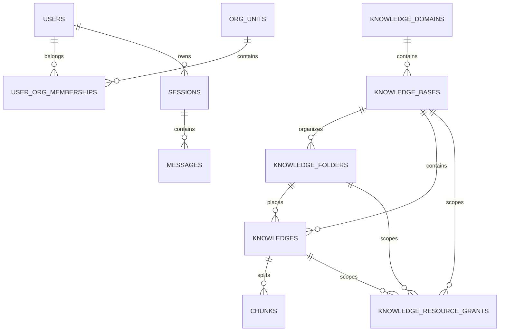

# 数据库与持久化目录

当前干净基线使用四类持久化系统：

| 系统 | 权威数据 | 是否必需 |
|---|---|---|
| PostgreSQL | 用户、权限、知识元数据、Chunk、会话、配置、审计 | 必需 |
| Milvus | Embedding 和检索过滤字段 | 标准部署必需 |
| Redis | Asynq、SSE、锁、短期计数器和缓存 | 必需 |
| local/MinIO/S3 | 原文件、解析图片、聊天附件 | 必需，三选一 |
| Neo4j | 实体、关系和来源 Chunk | 开启图谱时必需 |
| DuckDB | 会话内 Excel/CSV 分析临时表 | 数据分析工具按需 |

## 文档

- [PostgreSQL 表结构](postgresql-schema.md)
- [PostgreSQL 分组字段全景目录](../database-catalog/README.md)
- [Milvus、Redis、对象存储与 Neo4j](milvus-redis-storage.md)

数据库结构唯一事实来源：

```text
migrations/versioned/*.up.sql（按版本号顺序执行后的最终结构）
```

执行迁移 `000000` 到 `000002` 后共有 38 张应用表，迁移框架另有
`schema_migrations`。当前版本不创建 PostgreSQL 向量表。生产变更必须新增版本化
迁移，不能只依赖 GORM AutoMigrate。

## 关键 ID 关系



图中的三条 `KNOWLEDGE_RESOURCE_GRANTS` 关系是按 `resource_type + resource_id`
解释的逻辑关系。数据库只对 `knowledge_domain_id` 和 `knowledge_base_id` 建固定
外键；目录/文档多态目标由 Service 验证和清理。

Milvus 通过 `chunk_id`、`knowledge_id` 和 `knowledge_base_id` 与 PostgreSQL
关联；Neo4j 通过知识库/文档 namespace 与来源 `chunk_id` 关联；对象存储路径由
`knowledges.file_path` 和图片信息引用。
