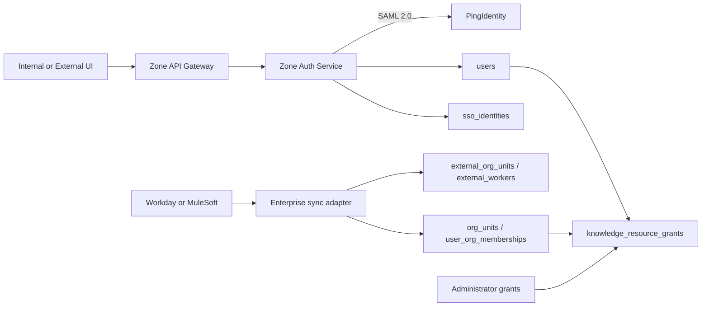

# PingIdentity SAML、OIDC Mock 与 Workday 集成

## 1. 责任边界

PingIdentity 解决“这个人是谁”；Workday 解决“这个员工当前属于哪个企业组织”；知识授权表解决“这个人可以读或管理哪些知识”。企业组织归属不会自动产生知识权限。



## 2. PingIdentity SAML 登录

生产使用独立 Auth Service 的 SAML 2.0 SP-initiated flow。内网和外网各注册一套 SP entity ID、ACS URL 和证书，但可以连接同一个 PingIdentity IdP。

主要接口：

```text
GET      /api/v1/auth/saml/config
GET      /api/v1/auth/saml/url
GET|POST /api/v1/auth/saml/acs
GET      /api/v1/auth/saml/metadata
```

Auth Service 校验 IdP 签名、断言有效期、audience、recipient、RelayState nonce 和 `InResponseTo`，再用稳定 NameID/映射属性 upsert `sso_identities` 和 `users`。外部 SAML 断言不会直接作为业务 API token；平台签发自己的短期 JWT 和可旋转 Refresh Token。

平台 JWT 只承载最小身份信息。知识权限在每次业务请求中按当前授权表计算，因此 Workday 调岗、用户停用或管理员撤权能影响后续请求，而不依赖重新登录才能刷新整套 ACL。

## 3. OIDC 仅用于开发 Mock

本地和服务器开发使用 Dex 执行真实 Authorization Code 流，用来在拿不到 PingIdentity 测试租户时验证重定向、state/nonce、外部身份映射和平台 token 生命周期。生产脚本强制：

```dotenv
OIDC_AUTH_ENABLE=false
SAML_AUTH_ENABLE=true
AUTH_PASSWORD_LOGIN_ENABLE=false
AUTH_REGISTRATION_ENABLE=false
```

## 4. Workday 同步

管理接口：

```text
POST /api/v1/system/admin/integrations/workday/sync
GET  /api/v1/system/admin/integrations/workday/runs
GET  /api/v1/system/admin/integrations/workday/runs/{run_id}
POST /api/v1/system/admin/integrations/workday/events
```

同步分两层：

1. 外部投影层保存 Workday 稳定 ID、checksum、有效期和必要属性。
2. 规范业务层更新 `org_units` 和 `user_org_memberships`。

员工使用 `external_worker_id` 对齐；企业邮箱只用于辅助关联已由 SSO 创建的本地用户。组织授权随成员关系变化：员工离开已获授权的组织节点后，不再通过该节点获得知识权限；单独授予该用户的规则仍独立有效。

## 5. 幂等、游标与审计

- `integration_sync_runs` 保存 full/incremental 模式、游标、计数和终态。
- `integration_events` 使用 `(provider, external_event_id)` 去重。
- checksum 未变化的组织或员工不重复写业务表。
- 每批成功后推进游标，失败不发布未完成游标。
- 离职或失效主体优先标记 inactive，不直接破坏历史审计关系。
- `trace_id` 连接请求、同步批次、事件、日志和错误。

## 6. 无企业端点时的开发方式

开发期使用 Dex 与 `config/mock/workday.json`，业务层始终依赖内部用户、组织和授权模型。拿到 PingIdentity metadata/attribute mapping 与 Workday/MuleSoft API 后，只替换集成适配配置，不推翻 `users`、`org_units`、`user_org_memberships` 和 `knowledge_resource_grants`。
