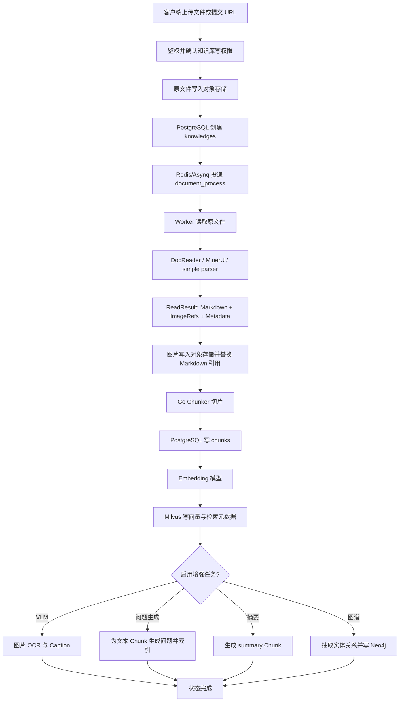

# 知识库构建全流程

本文说明文档、URL、手工 Markdown 和数据源同步如何进入知识库。核心入口位于：

- HTTP 路由：`internal/router/router.go`
- 上传 Handler：`internal/handler/knowledge.go`
- 创建记录：`internal/application/service/knowledge_create.go`
- 异步主流程：`internal/application/service/knowledge_process.go`
- 后处理编排：`internal/application/service/knowledge_post_process.go`
- 任务注册：`internal/container/task.go`

## 1. 总体流程



原文件先于解析写入对象存储。这样异步 Worker 可以在 HTTP 请求结束后读取同一份
原文件，重试也不需要客户端重新上传。对象存储地址保存在
`knowledges.file_path`；文件本体不会存入 PostgreSQL。

## 2. 创建阶段

### 2.1 文件上传

接口：

```text
POST /api/v1/knowledge-bases/{id}/knowledge/file
```

主要步骤：

1. Middleware 从平台 JWT 获取用户身份。
2. 知识库访问中间件检查当前用户是否具有该知识库的 `manage` 权限。系统管理员和
   知识域管理员会直接获得管理权限；普通用户也可以通过知识库级
   `knowledge_resource_grants(permission=manage, effect=allow)` 获得。
3. Handler 读取 multipart 文件及本次 `process_config`。
4. Service 校验扩展名、大小、知识库类型和有效处理配置。
5. 文件通过知识库选择的 `FileService` 写入 local、MinIO、S3 或其他兼容后端。
6. PostgreSQL 创建 `knowledges`，初始 `parse_status=pending`。
7. 创建 `knowledge_processing_spans` 初始阶段记录。
8. 向 Asynq 投递文档处理任务，HTTP 请求返回知识条目。

目录上传时，前端携带相对路径；后端用 `knowledge_folders` 创建目录树，并把
`knowledges.folder_id` 指向叶子目录。`knowledges.title` 仍是文档标题/文件名，
目录路径通过关联目录计算，不再混进标题。

上传目录本身会成为一级逻辑目录；其下的子目录和文件保留原层级。目录只是同一
物理知识库内的逻辑节点，后续可以在知识库外层“访问权限”弹窗中单独配置
allow/deny 规则。

### 2.2 URL 导入

接口：

```text
POST /api/v1/knowledge-bases/{id}/knowledge/url
```

普通网页 URL 由解析器直接读取。若 URL 指向可下载文件，Worker 会再次执行 SSRF
校验，下载后先写对象存储，再进入与文件上传相同的解析流程。

### 2.3 手工 Markdown

接口：

```text
POST /api/v1/knowledge-bases/{id}/knowledge/manual
```

手工内容保存在 `knowledges.metadata` 的手工内容结构中。发布后仍使用同一套 Go
Chunker、Embedding、Milvus 和增强任务流程；草稿不会直接进入可检索状态。

### 2.4 Google Drive 等数据源

`data_sources` 保存连接类型、目标知识库、同步策略和加密后的配置。同步器把远端
对象转化为普通知识创建请求，所以后续解析、切片、索引与本地上传一致。

远端目录映射为 `knowledge_folders`，远端文件 ID、版本、校验信息放在知识
`metadata` 或数据源同步状态中。当前数据源操作只改变本系统副本，不反向删除或
修改 Google Drive 原文件。

## 3. 解析阶段

Worker `ProcessDocument` 根据知识库配置解析文件：

| 引擎 | 选择条件 | 实现 |
|---|---|---|
| `builtin` | 显式选择内置解析 | DocReader gRPC |
| `mineru` | 自建 MinerU | Go 原生 HTTP Reader |
| `mineru_cloud` | MinerU Cloud | Go 原生 Cloud Reader |
| `simple` | 简单文本格式 | Go 本地 Reader |
| `paddleocr_vl` | 自建 PaddleOCR-VL | Go Reader |
| `paddleocr_vl_cloud` | 云服务 | Go Reader |
| 空值 | 简单格式走 simple，其余走 DocReader | 自动选择 |

统一请求对象是 `types.ReadRequest`，统一返回对象是：

```go
type ReadResult struct {
    MarkdownContent string
    ImageRefs       []ImageRef
    ImageDirPath    string
    Metadata        map[string]string
    Error           string
    IsAudio         bool
    AudioData       []byte
}
```

因此主流程不直接依赖 MinerU 的 ZIP 或中间 JSON。具体适配器负责把上游响应转换成
`ReadResult`，后面的图片解析和 Chunker 只消费这个统一结构。

### MinerU 自建响应

项目支持将下列形式转换为 `ReadResult`：

```json
{
  "results": {
    "document": {
      "md_content": "# 标题\n正文\n",
      "images": {
        "images/figure-1.png": "data:image/png;base64,iVBOR..."
      }
    }
  }
}
```

`md_content` 进入 `MarkdownContent`；`images` 中与 Markdown 引用匹配的内容解码为
`ImageRefs[].ImageData`。MinerU Cloud 下载 ZIP 时，也由 Cloud Reader 在内部解包
并生成相同的 `ReadResult`，ZIP 不作为知识库业务对象落库。

## 4. 图片处理

`ImageResolver` 处理四类图片来源：

1. `ImageRefs` 中的内联二进制。
2. Markdown 的 `data:image/...;base64`。
3. HTML `` 中的 data URI 或相对路径。
4. 通过 SSRF 校验的远程 HTTP/HTTPS 图片。

图片写入与原文相同的存储后端，Markdown 中原引用被替换为
`local://...`、`minio://...` 或 `s3://...` 等 provider URL。小于限制的装饰图标
会被过滤；远程图片还受数量、单图大小和超时限制。

图片归属不是语义分类。切片完成后，系统按下列规则寻找正文 Chunk：

```go
strings.Contains(parsedChunk.Content, storedImage.ServingURL)
```

也就是哪个 Chunk 的 Markdown 内容包含这张图片的新存储 URL，图片就归属哪个
Chunk；找不到时退回第一个 Chunk。VLM 生成的 `image_ocr` 和
`image_caption` Chunk 通过 `parent_chunk_id` 指向该正文 Chunk。

## 5. 切片与主索引

解析 Markdown 交给 `internal/infrastructure/chunker`。每个 ParsedChunk 包含：

- `Content`：原始正文切片。
- `ContextHeader`：标题面包屑，仅在内存中用于 Embedding。
- `Seq`：文档顺序。
- `Start` / `End`：在解析后 Markdown 中的字符位置。
- `ParentIndex`：父子切片时指向父块。

数据库先写 `chunks`，随后将 `ContextHeader + Content` 送入 Embedding 模型并
通过 RetrieveEngine 写 Milvus。`ContextHeader` 不落 PostgreSQL，用户查看 Chunk
时看到的仍是原始 `content`。

## 6. 异步增强与状态

主 Chunk 成功写入并索引后，文档已经可以用于普通检索。若还有增强任务，
`parse_status` 进入 `finalizing`，并通过 `pending_subtasks_count` 记录未完成数量：

| 子任务 | 条件 | 结果 |
|---|---|---|
| 摘要 | 配置摘要模型且需要摘要 | 新增 `summary` Chunk 并索引 |
| 问题生成 | 已启用且数量大于 0 | 问题写入 Chunk metadata，并作为独立索引文本 |
| VLM | 有图片且 VLM 已启用 | 新增 `image_ocr`、`image_caption` Chunk |
| 图谱 | 图谱索引开启且配置有效 | 抽取实体/关系并写 Neo4j |
| 表格摘要 | Excel/CSV 且配置模型 | 新增 `table_summary`、`table_column` Chunk |

最后一个子任务完成后状态转为 `completed`。失败阶段、耗时、输入输出摘要记录在
`knowledge_processing_spans`，主错误写入 `knowledges.error_message`。用户主动
取消后状态为 `cancelled`，已写入的数据保留，可重新解析。

## 7. 数据落点

| 数据 | 存储 |
|---|---|
| 知识库和文档元数据 | PostgreSQL |
| 原文件、解析图片、附件 | local / MinIO / S3 |
| Chunk 正文、位置、父子关系、图片描述 | PostgreSQL `chunks` |
| Chunk 和生成问题的向量索引 | Milvus |
| 实体、关系、来源 Chunk ID | Neo4j |
| 异步任务、计数器、流状态 | Redis |
| Excel/CSV 临时分析表 | 进程内 DuckDB，会话结束清理 |

解析后的完整 Markdown 当前作为流水线内存对象使用，没有单独的“完整 Markdown
文件表”。可重建信息来自原文件、解析配置、`knowledges` 和最终 `chunks`。

## 8. 目录和文档删除

知识库内部页面只负责浏览和上传。权限维护与删除操作统一收口到知识库列表卡片的
“访问权限”弹窗，避免在每个内部节点放置独立管理按钮。

删除目录不是只删 `knowledge_folders` 一行。后端会先找出整个目录子树和全部后代
文档，再复用文档完整删除流程，清理对象存储、Chunk、Milvus、Neo4j、标签关系和
文档 ACL，最后删除目录 ACL 与目录节点。详细规则见
[资源层级、授权与删除](resource-access-and-deletion.md)。
