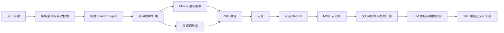

# 检索、重排与引用

## 1. 有效检索范围

`SearchTargets` 是进入 Retriever 和 Agent Tool 前已经算好的运行时范围，不落库。
它由 PostgreSQL 中的用户、组织、统一资源 ACL 和当前目录树计算：

1. 系统管理员：全部知识库都得到 `FullAccess`。
2. 知识域管理员：所辖知识域中的知识库都得到 `FullAccess`。
3. 普通用户：合并直接用户规则和有效组织节点/祖先节点上的
   `knowledge_resource_grants`。
4. 将知识库、祖先目录和精确文档规则应用到每份文档，deny 覆盖 allow。
5. 完整可读的知识库生成 `type=knowledge_base`。
6. 部分可读的知识库生成 `type=knowledge`，携带精确 `knowledge_ids`。

普通 RAG 和 Agent 的请求入口不同：

```text
普通 RAG：
  用户有效资源范围
  ∩ 请求指定的 knowledge_base_ids / knowledge_ids
  ∩ 请求指定的 tag scopes

Agent 启动：
  当前用户全部有效资源范围
```

Agent 不使用“智能体绑定知识库”或本轮 `@知识库` 作为授权输入。模型调用
`knowledge_search` 等工具时可以传 `knowledge_base_ids`，但工具只会在预计算的
用户范围内继续缩小，不可能扩大范围。所有知识工具复用同一份 `SearchTargets`，
避免模型通过换工具绕过授权。

## 2. 普通知识问答流水线



平台默认检索配置位于单例 `platform_runtime_configs.retrieval_config`：

| 参数 | 缺省值 |
|---|---:|
| `embedding_top_k` | 50 |
| `vector_threshold` | 0.15 |
| `keyword_threshold` | 0.3 |
| `rerank_top_k` | 10 |
| `rerank_threshold` | 0.2 |
| `rrf_k` | 60 |
| `rrf_vector_weight` | 0.7 |
| `rrf_keyword_weight` | 0.3 |

自定义智能体可以在自身配置中覆盖部分搜索参数，但这只影响召回质量，不改变权限。

## 3. Hybrid Search

语义检索先用 Embedding 模型把查询转为向量，再在 Milvus 按
`knowledge_base_id`、`knowledge_id`、`tag_id`、`is_enabled` 等条件过滤。
Milvus 不认识 `folder_id` 和 ACL；目录授权或黑名单会先在 PostgreSQL 中展开为
最终允许的 `knowledge_ids`：

```text
FullAccess:
  knowledge_base_id IN ["KB-A", "KB-B"]

PartialAccess:
  knowledge_base_id == "KB-C"
  AND knowledge_id IN ["DOC-1", "DOC-8"]
```

关键词检索使用启用 Analyzer/Match 的内容字段。两路候选通过 Reciprocal Rank
Fusion 合并；RRF 分数不是 0 到 1 的相似度，因此不能再套旧相似度阈值。

## 4. Rerank

Rerank 接收用户问题和第一阶段候选文本，给每个候选重新评分：

1. 先按 `chunk_id` 和内容签名去重，减少调用量。
2. 若配置专用 Rerank 模型，调用该模型。
3. 没有专用模型但有 Chat 模型时，可使用 LLM 重排。
4. 过滤低于 `rerank_threshold` 的候选。
5. 截取 `rerank_top_k`。
6. 使用 MMR 平衡相关性与内容多样性，避免十个结果都重复同一段。

Rerank 不产生新 Chunk，也不写回 Milvus。它只改变本次请求中的候选顺序。

## 5. 上下文扩展

候选确定后，系统可执行：

- 父块扩展：子 Chunk 命中后读取 `parent_chunk_id` 的父内容。
- 相邻扩展：根据 `pre_chunk_id` / `next_chunk_id` 补足断句。
- 关系扩展：读取关联 Chunk ID。
- 图片扩展：按正文 Chunk ID 查询其 `image_ocr` 和 `image_caption` 子块，把
  OCR/Caption 追加给 LLM，同时保留原图 URL 给前端引用。

最终引用仍使用命中证据的稳定 `chunk_id`，不是让 LLM 自己生成 UUID。

## 6. Agent 工具检索

Agentic 模式由模型选择工具：

| 中文名 | 工具名 | 主要用途 |
|---|---|---|
| 语义搜索 | `knowledge_search` | 1 到 5 个语义问题的混合检索 |
| 关键词搜索 | `grep_chunks` | PostgreSQL 正则查正文和文档标题 |
| 查看文档分块 | `list_knowledge_chunks` | 按文档分页或按 Chunk 精确读取 |
| 获取文档信息 | `get_document_info` | 文档/FAQ 元数据与处理状态 |
| 查询知识图谱 | `query_knowledge_graph` | Neo4j 实体和一跳关系 |
| 查询数据库 | `database_query` | 授权范围内三张知识表的只读 SQL |
| 查看数据元信息 | `data_schema` | 表格摘要和列说明 |
| 数据分析 | `data_analysis` | DuckDB 加载 Excel/CSV 并执行只读 SQL |

工具完整参数和输出见 [智能体运行时与工具](../agents/runtime-tools.md)。

## 7. 引用数据

消息生成时，后端把以下信息写入 `messages.knowledge_references`：

- `chunk_id`
- `knowledge_id`
- 文档标题和文件名
- Chunk 正文/展示片段
- 匹配分数和类型
- 图片信息

前端引用标签依赖这些稳定 ID 加载详情。显示“加载失败”通常表示引用 ID 对应的
Chunk 已被重解析/删除、当前用户权限已被撤销，或前端请求使用了过期会话身份。
模型输出中的 `<kb ... chunk_id="..."/>` 只负责标记位置，真实内容和权限仍由后端
根据 `chunk_id` 读取。
